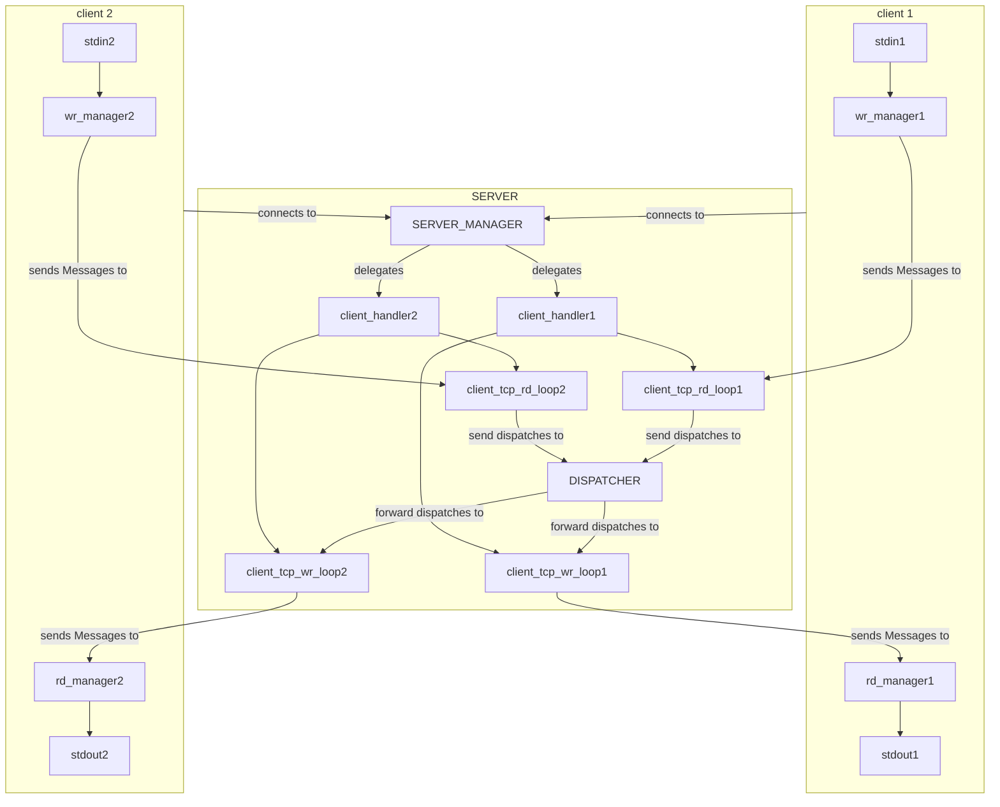

# kaban-chat
A chat made in Rust to practice my skills

## Developer's Guide

### lib.rs

The library documentation itsself should be quite self-explaining, a part for the term 'Paket' (and the derived term). A paket is what I call a Message **serialised with serde, binarized (put in bytes) and enclosed by the bytes `Message::PAKET_<INIT/END>_U8`**.

Regarding the errors: the choice had to be made between generic ones which could easily be converted (on the trace of the `anyhow` crate) or a bit more precise ones (on the trace of the `thiserror` crate). The choice fell on the latter one.

- `lib.rs`:
  - `enum TextValidityError`
    - TooLong
  - `enum MsgFromUtf8PaketError`
    - NoInitDelimiter
    - NoEndDelimiter
    - SerdeJson
    - StringFromUtf8
    - EmptyPaket
  - `enum MsgReaderError`
    - conversion from various underlying errors
    - EmptyEntity

### The server and client architecture

The server and the clients are exchanging Message(s), i.e. structs `struct Message { username: String, content: String, }`. In the server such Messages are then wrapped in a `struct Dispatch { userid: integer, msg: Message, }`. The server and the client have together this structure (approximatively) :

## My Targets

- add the id pool and the id_pool token redemption for the graceful shutdown of client handlers in the server
- update naming in README.md
- merge all of this into the master branch

- graceful shutdown for the whole client
- graceful shutdown for the whole server
- merge this into master

- tracing in the lib
- tracing in the client
- tracing in the server

After this the project can be considered finished. Future projects might be implementing new features on this structure,
as for example:
- adding a GUI
- adding encryption
- adding optimization of resources, letting tests be faster etc...