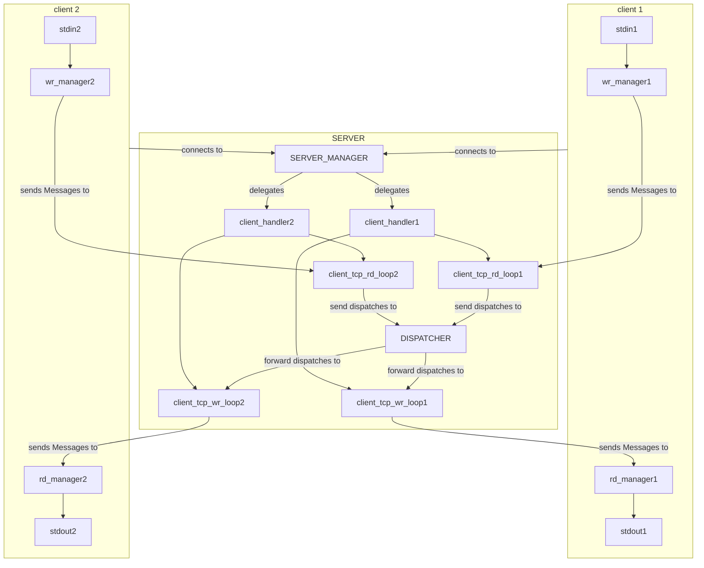

# kaban-chat
A chat made in Rust to practice my skills

## Developer's Guide

The server and the clients are exchanging Message(s), i.e. structs `struct Message { username: String, content: String, }`. The server has a structure of this kind:

### Error types

The choice had to be made between generic errors which could easily be converted (on the trace of the `anyhow` crate) or a bit more precise errors (on the trace of the `thiserror` crate). The choice fell on the latter one.

- `lib.rs`:
  - `enum MessageError`
    - TooLongUsername
    - TooLongContent
    - InvalidCharsUsername
    - InvalidCharsContent
  - `enum ReaderError`
    - conversion from async io error
    - propagation of MessageError

## Notes for me

- test: you should write quite a lot of unit tests
- implement error_handling: write your own errors or convert with anyhow crate? (search for `panic` and `unwrap`)

- graceful shutdown: add the id pool and recall to check for the id_pool token redemption
- id pool: it could be sharded to avoid bottlenecks if many client_handlers must access the same resource.